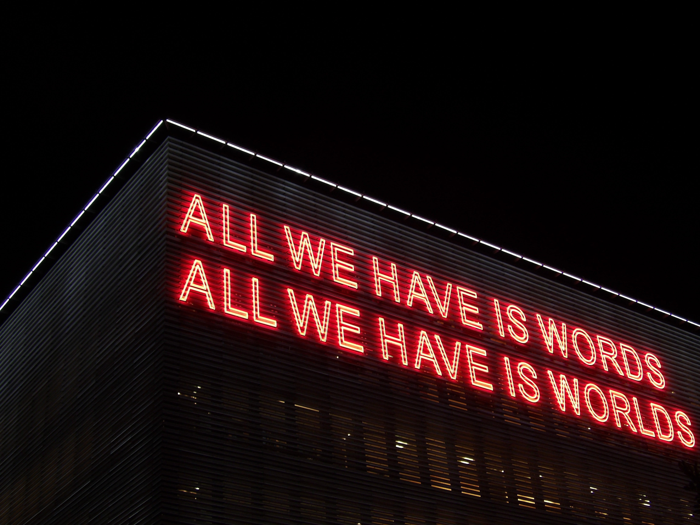

```{r setup, include=FALSE}
usethis::use_git_ignore(c("*.csv", "*.rds"))
options(htmltools.dir.version = FALSE)

library(knitr)
library(tidyverse)
library(xaringan)
library(fontawesome)
```

class: inverse, center, middle

**View the slides:** 

[bretsw.github.io/eme6357-module1](https://bretsw.github.io/eme6357-module1)

---

class: inverse, center, middle

# Module 1 readings

---

class: inverse, center, middle

# Evaluation vs. research <br> (Boothroyd, 2018)

---

# Defining evaluation

```{r, out.width = "600px", echo = FALSE, fig.align = "center"}
include_graphics("img/measure.jpg")
```

--

*systematic collection of information, for use by people to make decisions to improve training programs*

---

# Evaluation vs. research

```{r, out.width = "480px", echo = FALSE, fig.align = "center"}
include_graphics("img/tools.jpg")
```

--

- Both are rigorous

--

- Both allow for similar designs and methodologies

--

- **Evaluation** is timely and constructive, aiming to improve programs

--

- **Research** is meant to produce generalizable knowlege, aiming to better the field

---

class: inverse, center, middle

# Types of evaluation <br> (CDC)

---

# Formative evaluation

```{r, out.width = "600px", echo = FALSE, fig.align = "center"}
include_graphics("img/shape.jpg")
```

--

- Needs assessment

--

- Process/implementation evaluation

---

# Summative evaluation

```{r, out.width = "600px", echo = FALSE, fig.align = "center"}

```

--

- Outcome/effectiveness evaluation (objective, performance indicators)

--

- Impact evaluation

--

- Economic evaluation (cost, cost-benefit, cost-utility)

---

class: inverse, center, middle

# Methods of evaluation <br> (WHO)

---

# Qualitative evaluation

```{r, out.width = "720px", echo = FALSE, fig.align = "center"}

```

---

# Quantitative evaluation

```{r, out.width = "600px", echo = FALSE, fig.align = "center"}
include_graphics("img/numbers.jpg")
```

--

- Randomized control trial (RCT)

--

- Quasi-experiment

--

- Before-after

---

class: inverse, center, middle

# 4 Levels <br> (Kirkpatrick & Kirkpatrick, 2006)

*Systemic evaluation of training programs*

---

# Kirkpatrick's 10 steps to plan

```{r, out.width = "420px", echo = FALSE, fig.align = "center"}

```

1. Determining needs
2. Setting objectives
3. Determining subject content
4. Selecting participants
5. Determining the best schedule
6. Selecting appropriate facilities
7. Selecting appropriate instructors
8. Selecting and preparing audiovisual aids
9. Coordinating the program
10. Evaluating the program

---

# Kirkpatrick's 10 steps to plan

```{r, out.width = "420px", echo = FALSE, fig.align = "center"}

```

1. Determining needs
2. Setting objectives
3. Determining subject content
4. Selecting participants
5. Determining the best schedule
6. Selecting appropriate facilities
7. Selecting appropriate instructors
8. Selecting and preparing audiovisual aids
9. Coordinating the program
10. **Evaluating the program** `r fa("arrow-right", fill = "#782F40")` **implementing the 4 levels**

---

# Kirkpatrick's 4 Levels

```{r, out.width = "480px", echo = FALSE, fig.align = "center"}

```

--

1. **Reaction**

--

2. **Learning**

--

3. **Behavior**

--

4. **Results**

---

# Start with "Why?" when planning

```{r, out.width = "480px", echo = FALSE, fig.align = "center"}

```

## 4. Results `r fa("arrow-right", fill = "#782F40")` 3. Behavior `r fa("arrow-right", fill = "#782F40")` 2. Learning `r fa("arrow-right", fill = "#782F40")` 1. Reaction

---

# Go in order when evaluating

```{r, out.width = "480px", echo = FALSE, fig.align = "center"}

```

1. **Reaction**
2. **Learning**
3. **Behavior**
4. **Results**

---

# Go in order when evaluating

```{r, out.width = "480px", echo = FALSE, fig.align = "center"}

```

1. **Reaction** `r fa("arrow-right", fill = "#782F40")` **customer satisfaction**
2. **Learning**
3. **Behavior**
4. **Results**

---

# Go in order when evaluating

```{r, out.width = "480px", echo = FALSE, fig.align = "center"}

```

1. **Reaction**
2. **Learning** `r fa("arrow-right", fill = "#782F40")` **attitudes changed, knowledge increased, or skills improved**
3. **Behavior**
4. **Results**

---

# Go in order when evaluating

```{r, out.width = "480px", echo = FALSE, fig.align = "center"}

```

1. **Reaction**
2. **Learning**
3. **Behavior** `r fa("arrow-right", fill = "#782F40")` **observable change that transfers to job**
4. **Results**

---

# Go in order when evaluating

```{r, out.width = "480px", echo = FALSE, fig.align = "center"}

```

1. **Reaction**
2. **Learning**
3. **Behavior**
4. **Results** `r fa("arrow-right", fill = "#782F40")` **the ultimate goal, the planned outcome, the "Why?"**

---

class: inverse, center, middle

# Looking ahead

---

# Semester schedule

```{r, out.width = "480px", echo = FALSE, fig.align = "center"}
include_graphics("img/across-time-full.jpg")
```

- **Module 1: What is Evaluation?**

- Module 2: Systems Analysis & Training Programs

- Module 3: Evaluation Methodology

- Module 4: Creating an Evaluation Plan

---

# Module structure

```{r, out.width = "540px", echo = FALSE, fig.align = "center"}
include_graphics("img/workshop.jpg")
```

- `r fa("video", fill = "#782F40")` Meet (Wednesdays at 8pm EST on Zoom)

- `r fa("book-open", fill = "#782F40")` Read

- `r fa("comments", fill = "#782F40")` Discuss (Flipgrid)

- `r fa("user-edit", fill = "#782F40")` Evaluate (group project)

---

# Major Assignments

```{r, out.width = "320px", echo = FALSE, fig.align = "center"}
include_graphics("img/build.jpg")
```

- **Flipgrid discussions** (200 points)

- **Case study facilitation** (group project; 100 points)

- **Evaluation plan** (group project; 700 points)

  - Training program description (100 points)

  - Systemic analysis of a training program (200 points)

  - Peer review of systemic analysis (100 points)

  - Evaluation management plan (300 points)

---

# Flipgrid Discussions

```{r, out.width = "480px", echo = FALSE, fig.align = "center"}
include_graphics("img/chat.jpg")
```

--

- Text, audio, and video comments are all fine

--

- 30-second comments can be just as good as 90-second ones

--

- Responding to those who respond to you is great (threads)

--

- Ending your comments with a question is great

--

- **Main rubric: Move the the conversation forward**

---

# Case Study Facilitation

```{r, out.width = "480px", echo = FALSE, fig.align = "center"}
include_graphics("img/chat2.jpg")
```

--

[Read the Case Study Discussion Facilitation instructions](https://canvas.fsu.edu/courses/181923/assignments/1299968?module_item_id=3197033)

--

- **Part 1: Introduce the case.** Your materials will be posted on Canvas.

--

- **Part 2: Create a few discussion prompts.** Your prompts will be listed on Canvas as on Flipgrid.

--

- **Part 3: Keep the discussion going.** Stay active on Flipgrid.

---

# Training Program Description

```{r, out.width = "480px", echo = FALSE, fig.align = "center"}
include_graphics("img/group-project.jpg")
```

--

- First part of the main course assignment: Evaluation Plan

--

- This is a group project, working with the same group as your Case Study Facilitation

--

- This first part is fairly short and is due at the end of Module 1

---

class: inverse, center, middle

# Questions?

```{r, out.width = "480px", echo = FALSE, fig.align = "center"}
include_graphics("img/question.jpg")
```

**What questions can I answer for you now?**

**How can I support you this week?**

<hr>

`r fa("envelope", fill = "white")` [bret.staudtwillet@fsu.edu](mailto:bret.staudtwillet@fsu.edu) | `r fa("twitter", fill = "white")` [@bretsw](https://twitter.com/bretsw) | `r fa("globe", fill = "white")` [bretsw.com](http://bretsw.com)